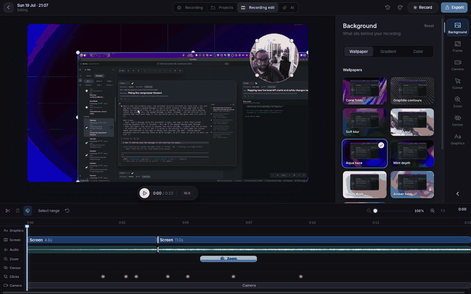

# Rough Cut

A screen recorder and editor for Linux (X11), built for tutorials, demos and product walkthroughs.

- Record the screen, with optional camera and microphone, plus cursor and click data.
- Trim, cut and zoom on one shared timeline; the viewer shows exactly what you will export.
- Add animated graphics drawn over the video.
- Export a finished MP4: background, rounded frame, camera, zooms, animations and sound. Every export is checked when it finishes, and each video lives in its own dated project folder.



Useful commands:

- `pnpm dev` starts the Electron app in development mode.
- `pnpm test` runs the full build and automated test suite.
- `pnpm smoke:mvp` records a short X11 capture, reopens it, and exports it.
- `pnpm smoke:ui` launches Electron against a synthetic project and verifies preview/export UI.
- `pnpm package:linux` creates a local Linux artifact at `dist/rough-cut-mvp-linux-x64`.
- `pnpm smoke:package` builds that artifact and verifies it can launch, preview, and export.

## Local transcription

Rough Cut uses local Whisper-compatible engines and never requires a cloud
transcription provider. It automatically uses an installed Vibe/Sona model on
Linux and macOS. Both providers process resumable 15-second chunks while capture
health is safe; capture warnings immediately suspend analysis and recording stop
finishes any remaining audio.

For incremental transcription during recording, install `whisper-cli`, download
a compatible GGML model, then launch Rough Cut with:

```bash
ROUGH_CUT_WHISPER_MODEL_PATH=/absolute/path/to/ggml-base.en.bin pnpm dev
```

Use `ROUGH_CUT_WHISPER_COMMAND` when `whisper-cli` is not on `PATH`, and
`ROUGH_CUT_TRANSCRIPTION_LANGUAGE` to replace automatic language detection.
Use `ROUGH_CUT_SONA_MODEL_PATH` or `ROUGH_CUT_SONA_COMMAND` to override Sona
discovery.
Set `ROUGH_CUT_SMART_ROUGH_CUT=0` to explicitly disable background
transcription.

Run the real long-workflow gate against a recording or source video with:

```bash
ROUGH_CUT_LONG_BENCHMARK_SOURCE=/absolute/path/to/recording.mp4 \
  pnpm benchmark:smart-rough-cut -- --output=/tmp/rough-cut-smart-benchmark.json
```

The gate requires at least 60 minutes by default, rejects transcript fixtures,
and records transcription, suggestion, finalize/reopen, memory, and export
parity evidence. `--skip-export` and `--allow-short` are development-only
shortcuts and do not satisfy the complete gate.

## License

Rough Cut is free software, released under the [GNU Affero General Public License v3.0](LICENSE). Everything in this repository is free to use, study, change and share under that licence.

A paid Pro edition with new features may come later.
