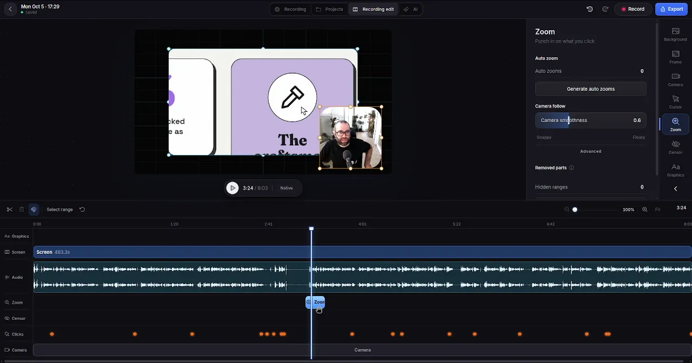

# Rough Cut

**Beta (v0.1.0-beta).** A free screen recorder and editor for Linux (X11), built for tutorials, demos and product walkthroughs. Record your screen, trim and zoom on one timeline, add animated graphics, and export a finished MP4.



## What it does

- **Record** the screen (full display, a window area or a region), with optional camera and microphone. Cursor position and clicks are recorded alongside the video.
- **Edit on one timeline.** Trim, cut and zoom; the viewer shows what you will export.
- **Auto-zoom and styled cursor** that follow your clicks.
- **Look.** Backgrounds, rounded frame and a camera bubble.
- **Animated graphics** drawn over the video, written from a text prompt (needs your own Claude Code login, see Privacy).
- **Export** an MP4 with the background, frame, camera, zooms, animations and sound. Each export is checked when it finishes, and every video lives in its own dated project folder.

<!-- GIFs to be added: -->
<!--  -->
<!--  -->
<!--  -->
<!--  -->
<!--  -->
<!--  -->

## Requirements

| Need | Notes |
|------|-------|
| Linux with an **X11** session | Wayland is **not supported**. Log in with an X11 session. |
| `ffmpeg` and `ffprobe` | Used for capture, processing and export. Not bundled. |
| `xdotool` | Cursor position. Not bundled. |
| `xinput` | Mouse clicks for auto-zoom. Not bundled. |
| Tested on | KDE Plasma with an NVIDIA GPU. Other desktops and GPUs are untested. |

On Debian/Ubuntu: `sudo apt install ffmpeg xdotool xinput`.

**NVIDIA users:** open `nvidia-settings`, go to OpenGL Settings, and turn **Allow Flipping** off. With it on, the screen grab can occasionally contain torn frames. The setting persists across reboots.

Optional: the `claude` command (Claude Code), logged in, for AI graphics.

## Install

> Download links will appear on the Releases page when the beta is published.

- **AppImage** (if available for this release): `chmod +x Rough-Cut-*.AppImage && ./Rough-Cut-*.AppImage`
- **tar.gz**: unpack it anywhere and run the `run.sh` inside.

**If the app does not start on Ubuntu 24.04 or newer:** the system restricts the Chromium sandbox that Electron apps use. You will typically see a message about the "SUID sandbox helper". Either give the bundled helper the right permissions (from the folder that contains `chrome-sandbox`):

```bash
sudo chown root:root chrome-sandbox && sudo chmod 4755 chrome-sandbox
```

or start the app with `--no-sandbox` (this turns off a security layer; the app only loads local content, but prefer the first option).

## First run

1. Start Rough Cut. It opens on the Projects page.
2. Click **Record** (top right). A separate recorder window opens where you choose the screen or region, camera and microphone.
3. Press Start, record, press Stop. The take opens in **Recording edit** a moment later.
4. Trim, zoom, style, then export.

## Where your files are

| What | Where |
|------|-------|
| Recordings | `~/Documents/Rough Cut MVP/recordings` |
| Exports | `~/Documents/Rough Cut MVP/exports` (you can pick another folder when exporting) |
| Settings | `~/.config/rough-cut-mvp` |
| Logs | `~/.config/rough-cut-mvp/logs` |

## Privacy

- The Rough Cut code makes no network calls of its own: no telemetry, analytics, crash reporting or auto-update. Recordings stay on your machine.
- The embedded Chromium engine (part of Electron) may make DNS-related connections on its own, outside the app code.
- AI graphics are optional. When you use them, your prompt is sent through **your own Claude Code login** to Anthropic. Debug copies of recent AI exchanges are saved locally under `~/.config/rough-cut-mvp/claude-log`.

## Known limits

- Linux X11 only. No Wayland, Windows or macOS builds yet.
- Tested only on KDE Plasma with NVIDIA. Expect rough edges elsewhere.
- Beta software: back up recordings you cannot redo.
- Electron 35 is out of support; the upgrade is planned for 0.1.1 (see [SECURITY.md](SECURITY.md)).

## Local transcription (optional)

Rough Cut can use local Whisper-compatible engines and never needs a cloud transcription provider. It uses an installed Vibe/Sona model automatically, or `whisper-cli` with a GGML model:

```bash
ROUGH_CUT_WHISPER_MODEL_PATH=/absolute/path/to/ggml-base.en.bin rough-cut
```

Other environment variables: `ROUGH_CUT_WHISPER_COMMAND`, `ROUGH_CUT_TRANSCRIPTION_LANGUAGE`, `ROUGH_CUT_SONA_MODEL_PATH`, `ROUGH_CUT_SONA_COMMAND`. Set `ROUGH_CUT_SMART_ROUGH_CUT=0` to disable background transcription.

## Contributing and security

Developer setup and commands are in [CONTRIBUTING.md](CONTRIBUTING.md). Report vulnerabilities as described in [SECURITY.md](SECURITY.md). Third-party licences are in [THIRD_PARTY_NOTICES.md](THIRD_PARTY_NOTICES.md).

## License

Copyright (C) 2026 Noam Naumovsky.

Rough Cut is free software, released under the [GNU Affero General Public License v3.0](LICENSE). Everything in this repository is free to use, study, change and share under that licence.

